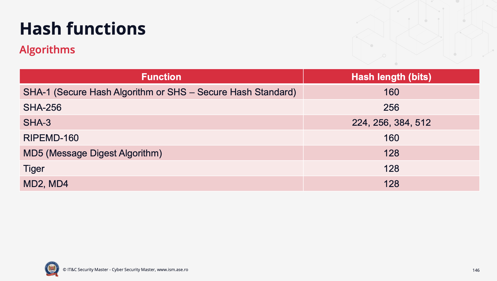
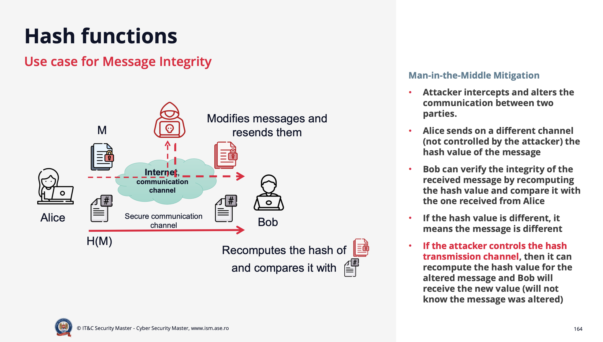
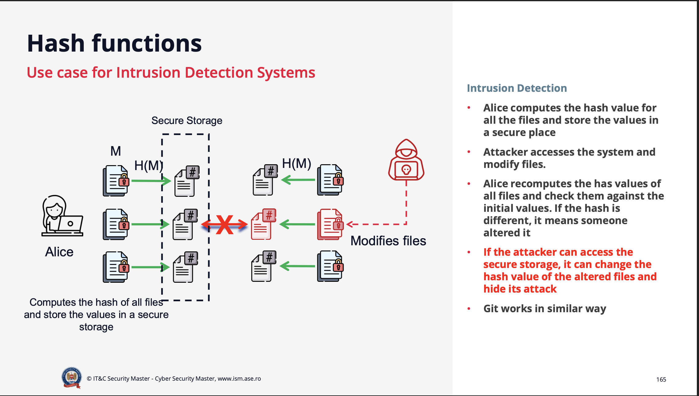
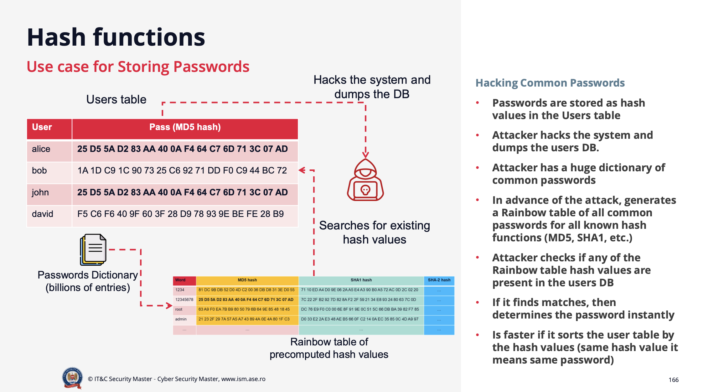

# Hash Functions

- See last section for references of the next affirmations.

> **Hash functions** are magical functions that take an input (or 'message') and return a fixed-size string of bytes. The output is typically a 'digest' that is unique to each unique input.

**Purpose of Hash Functions:** data integrity to messages/files. For a number you get the same output every time. If you change even one bit of the input, the output will change completely.

> Hash Functions do not encrypt data. They are one-way functions, meaning you cannot reverse the process to retrieve the original input from the hash output.

## Characteristics of Hash Functions

A **hash function** is a mathematical function that takes an input message `M` of variable length and produces a fixed-length output called the **hash value** or **message digest**, denoted as `h = H(M)`.

---

### Key Characteristics

1. **Easy to Compute (Forward Direction)**
   - For any input `M`, it is computationally *easy* to calculate the hash value `h = H(M)`.

2. **One-Way Property**
   - Given only `h`, it is *impossible* (computationally infeasible) to determine the original input `M`.  
     → This is known as **pre-image resistance**.
     →  Pre-Image Resistance: The difficulty of reversing the hash function to find the original input.

3. **Collision-Free (Resistance) Property**
   - It is *very difficult* to find two distinct messages `M` and `M′` such that:

     ```txt
     H(M) = H(M′)
     ```

   - This property ensures **collision resistance** — two different inputs should never produce the same hash value.

4. **Avalanche Effect**
   - Changing even a **single bit** in `M` will completely change the output `h`.  
     → The new hash appears totally unrelated to the previous one.

5. **Fixed-Length Output**
   - Regardless of the input size (1 byte or 1 GB), the hash function always outputs a fixed-length value (e.g., 128 bits for MD5, 256 bits for SHA-256).

6. **Puzzle Friendly**
   - For any hash result h, even if someone knows a random value r (chosen from a very large set of possibilities), it should be practically impossible for them to figure out what original message M would produce that hash result:

     ```txt
     H(r || M) = h
     ```

   - This property is useful in **proof-of-work** systems, where finding such an `M` requires significant computational effort.

---

## MD5 Algorithm

**MD5 (Message-Digest Algorithm 5)** is a widely known cryptographic hash function that produces a 128-bit (16-byte) hash value, typically expressed as a 32-character hexadecimal number.

### MD5 Usage

MD5 was commonly used for:

- **File integrity verification** - ensuring files haven't been corrupted during transfer
- **Digital fingerprinting** - creating unique identifiers for files
- **Password storage** - storing hashed passwords in databases
- **Checksums** - verifying data integrity in various applications

### Security Status: **DEPRECATED** ⚠️

**MD5 is cryptographically broken and unsuitable for further use:**

- **Collision vulnerabilities**: Researchers have demonstrated practical collision attacks
- **Speed weakness**: MD5 is too fast, making brute-force attacks feasible
- **Rainbow table attacks**: Pre-computed hash tables make password cracking easier
- **Not recommended** for any security-critical applications

### Modern Alternatives

Instead of MD5, use:

- **SHA-256** or **SHA-3** for general cryptographic purposes
- **bcrypt**, **scrypt**, or **Argon2** for password hashing
- **BLAKE2** for high-performance applications

### Examples (MD5)

| Input | Output (MD5 hash) |
|--------|-------------------|
| `a` | `0C C1 75 B9 C0 F1 B6 A8 31 C3 99 E2 69 77 26 61` |
| `b` | `92 EB 5F FE E6 AE 2F EC 3A D7 1C 77 75 31 57 8F` |
| `1 GB file` | `1D B9 DF A8 F2 7E 36 37 7C 07 5A C0 B8 4C 08 F3` |

Notice that even for extremely large files, the output has the same fixed size.

> **Note**: These examples demonstrate MD5's properties but remember that MD5 should not be used in production systems due to security vulnerabilities.



---

### Fundamental Properties

| Property | Description |
|-----------|--------------|
| **Deterministic** | The same input always produces the same output. |
| **Fast Computation** | Hashing is designed to be efficient and quick. |
| **Pre-Image Resistance** | Hard to find `M` given `H(M)`. |
| **Collision Resistance** | Hard to find `M` and `M′` such that `H(M) = H(M′)`. |
| **Puzzle Friendly** | Slightly changing the input leads to unpredictable outputs, useful for proof-of-work systems. |

---

### Visual Summary

```txt
    ┌───────────────────────┐
    │       Message (M)     │
    └───────────────────────┘
                │
                ▼
         h = H(M)   →  Hash Function
                │
                ▼
    ┌────────────────────────────┐
    │   Message Digest (hash h)  │
    └────────────────────────────┘
```

- It’s **easy** to go from message → hash.  
- It’s **impossible** to go back from hash → message.

---

**Summary:**
Hash functions are the backbone of data integrity, authentication, and digital signatures.  
Their strength lies in being **one-way, collision-resistant, and deterministic**, ensuring that even the smallest change in data is immediately detectable.

## When to use Hash Functions?

- **Data Integrity**: Verify that data has not been altered during transmission or storage.
- **Digital Signatures**: Create a unique fingerprint of a message to sign it securely.
- **Password Storage**: Store hashed passwords instead of plaintext to enhance security.
- **Proof-of-Work Systems**: Use in blockchain and cryptocurrency mining to ensure computational effort.
- **File Verification**: Check file integrity after downloads or transfers.
- **Extend/Reduce secret values** to a predefined size
  - Password: 123abc456 → Adding a padding to 20 bytes will not be secure (the attacker can see the padding and brute-force the password)
  - Key derivation functions (KDFs) are used to derive keys from passwords
  - For this usecase, salt is useless but we can hash it because will result in a fixed size

### Birthday Paradox and Collisions

- Hash functions can produce collisions, where two different inputs yield the same hash output.
- The **birthday paradox** illustrates that in a group of people, the probability of two sharing a birthday is surprisingly high. Similarly, in hash functions, as more inputs are hashed, the chance of collisions (two different inputs producing the same hash) increases.
- For a hash function with an `n`-bit output, the probability of a collision becomes significant after hashing about `2^(n/2)` different inputs.
- Hash functions can produce collisions, where two different inputs yield the same hash output. The **Birthday Paradox** provides a mathematical foundation for understanding collision probability in hash functions.

### Understanding the Birthday Paradox

#### Step 1: The Classic Birthday Problem

The Birthday Paradox states that in a room of just 23 people, there's a **50% probability** that two people share the same birthday. This seems counterintuitive because there are 365 possible birthdays.

#### Step 2: Mathematical Foundation

For **N different possibilities** of an event to happen, you need approximately **√N random items** for them to have a 50% chance of collision.

**Formula:** √N ≈ 2^(n/2) where n is the number of bits

#### Step 3: Birthday Examples

- **365 different birthdays**: √365 ≈ 19.1 → **~23 people** needed for 50% collision chance
- **Different scenario**: To have 50% probability that someone shares **your specific birthday**, you need **253 people** in the room

#### Step 4: Application to Hash Functions

The Birthday Paradox directly applies to hash function vulnerabilities:

1. **For an n-bit hash function**: A collision can be found in approximately **2^(n/2)** tries
2. **MD5 example**: 128-bit output → collision in **2^64** attempts (not 2^128)
3. **SHA-256 example**: 256-bit output → collision in **2^128** attempts (not 2^256)

#### Step 5: Birthday Attack Mechanism

The **birthday attack** exploits this paradox:

```txt
1. Generate many random messages M₁, M₂, M₃, ...
2. Calculate their hashes: H(M₁), H(M₂), H(M₃), ...
3. Continue until H(Mᵢ) = H(Mⱼ) for i ≠ j
4. Success! Found collision: H(Mᵢ) = H(Mⱼ) where Mᵢ ≠ Mⱼ
```

#### Step 6: Security Implications

- **Hash strength is halved**: An n-bit hash has only **n/2 bits** of collision resistance
- **Attack efficiency**: Birthday attacks find collisions with ~50% probability much faster than brute force
- **Real-world impact**: This is why MD5 (128-bit) is considered broken - only **64 bits** of effective security

### Visual Representation

```txt
Hash Function Security:
    Theoretical: 2ⁿ operations needed
    Reality:     2^(n/2) operations needed (Birthday Attack)

Examples:
    MD5 (128-bit):    2^128 → 2^64 operations
    SHA-1 (160-bit):  2^160 → 2^80 operations  
    SHA-256 (256-bit): 2^256 → 2^128 operations
```

### Key Takeaways

- Hash functions have **half their advertised security** due to birthday attacks
- **Collision resistance** is the limiting factor, not pre-image resistance
- Modern hash functions must account for birthday attacks in their design
- This is why cryptographers recommend hash functions with **double the desired security level**

## Hash Use Cases





### Hash Functions in Password Storage

- Storing passwords in plaintext is a major security risk. 

```txt
Database Table: users

1. 0 Security
┌──────────┬──────────────────┐
│ username │ password         │
├──────────┼──────────────────┤
│ john     │ 123456           │
│ alice    │ qwerty           │       
└──────────┴──────────────────┘

Problem: Passwords stored in plaintext
   - Anyone with database access sees all passwords
   - Data breaches expose user credentials directly
   - No protection against insider threats

2. Hashed Passwords
┌──────────┬──────────────────┐
│ username │ password         │
├──────────┼──────────────────┤
│ john     │ hash1            │
│ alice    │ hash2            │
│ bob      │ hash1            │
└──────────┴──────────────────┘

Problem: Conflict of the passords
   - Two users (john and bob) have the same password (123456)
   - Both passwords hash to the same value (hash1)
   - An attacker who knows one password can compromise both accounts
   - If Alice has a good password, she is safe because cannot reverse the hash

3. Salted Passwords
   - Adding "ICM" as salt to each password before hashing
┌──────────┬──────────────────┐
│ username │ password         │
├──────────┼──────────────────┤
│ john     │ hash1            │
│ alice    │ hash2            │
│ bob      │ hash1            │
└──────────┴──────────────────┘

- There is still a conflict between john and bob
- Now we can make sure that it is not in the list of the week passwords -> admin1234 becomes admin1234ICM

4. Random Salted Passwords
   - Each user gets a unique random salt
┌──────────┬──────────────────┬───────────────┐
│ username │ password         │     salt      │
├──────────┼──────────────────┼───────────────┤
│ john     │ hash1            │ random_salt1  │
│ alice    │ hash2            │ random_salt2  │
│ bob      │ hash3            │ random_salt3  │
└──────────┴──────────────────┴───────────────┘

Status: No conflicts, even if passwords are the same
   - Each password is combined with a unique random salt before hashing
   - Even if two users have the same password, their hashes will differ due to different salts
   - An attacker cannot use precomputed hash tables (rainbow tables) effectively
   - Significantly increases security against brute-force and dictionary attacks
   - Uses puzzle-friendly property of hash functions to make guessing passwords computationally expensive
```

- **Salting** adds a unique random value to each password before hashing, ensuring that even identical passwords produce different hashes.


